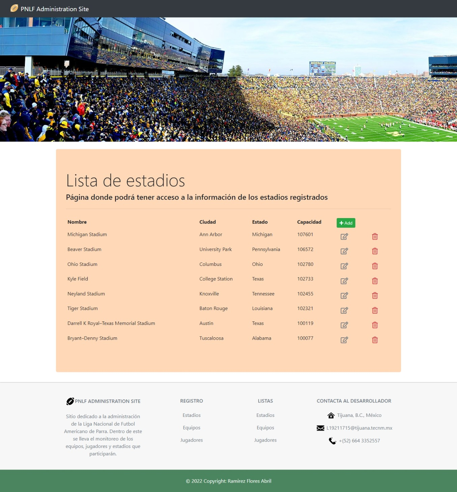
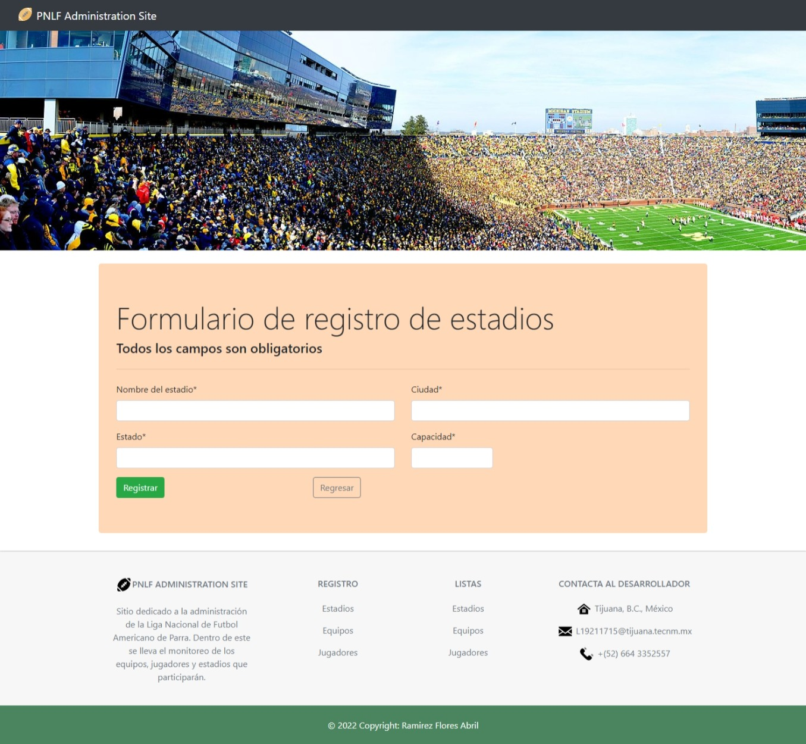
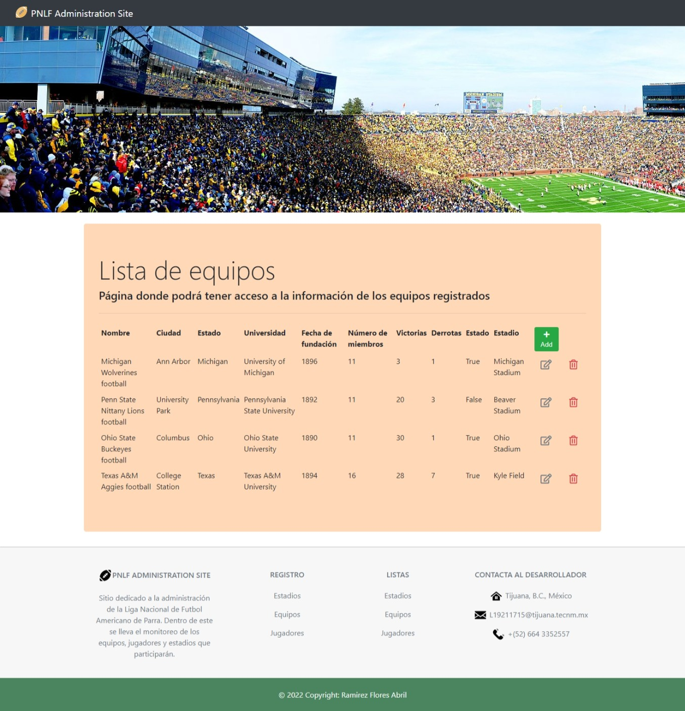
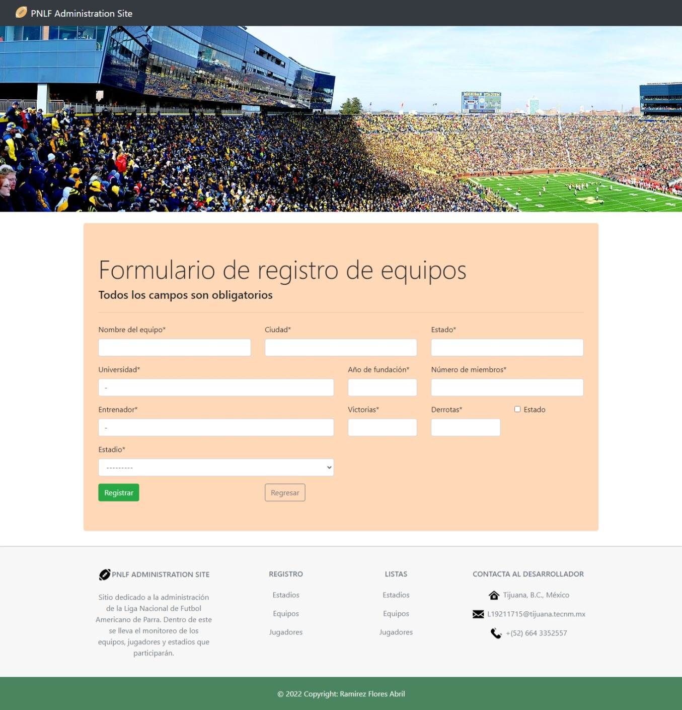
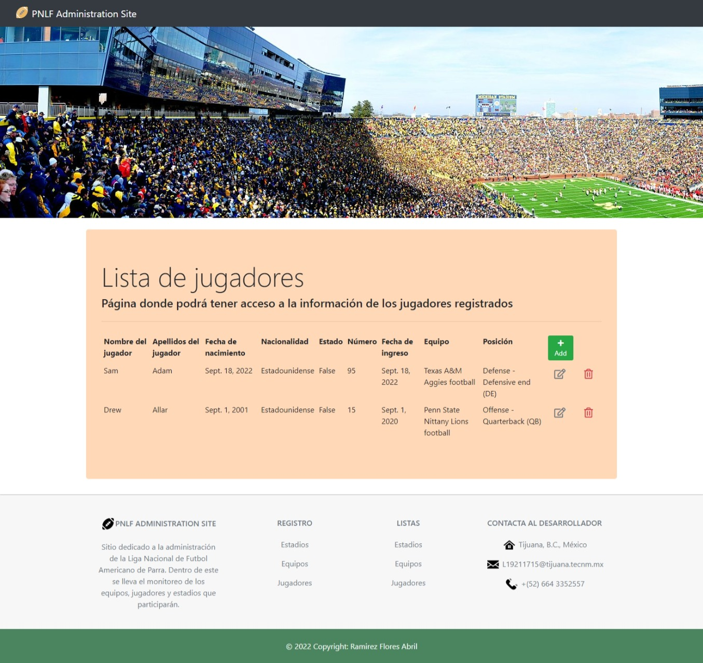
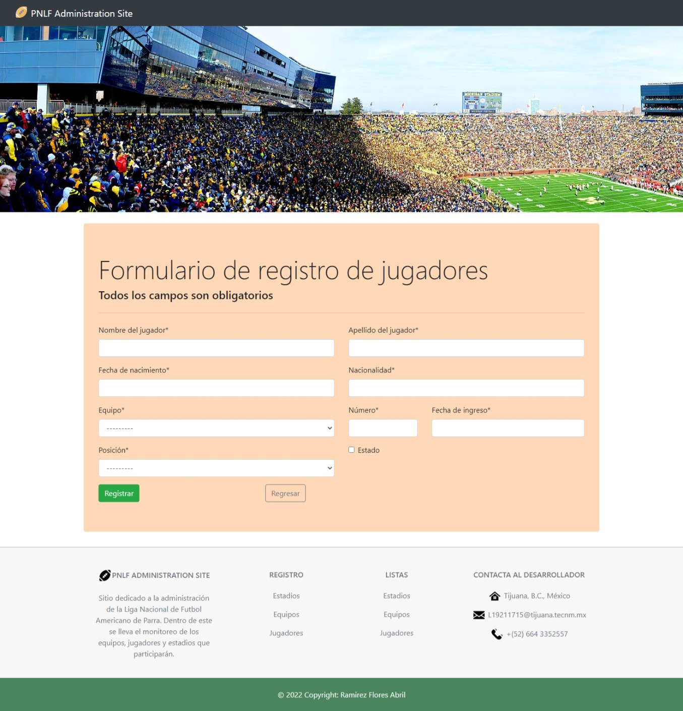

# Parra's National League Football :football:

## Proyecto - Examen correspondiente a la Unidad 1 de la materia de Programación Web

  

### **|-----| Descripción |-----|**
En la ciudad TJ, se celebra el primer torneo de la liga PNLF (Parra National League Football). La liga necesita una aplicación web que le permita tener el control de movimientos CRUD de los equipos, los estadios y los jugadores. Por tal motivo la liga hace el anuncio para solicitar la aplicación a las casas de software locales. Para poder solicitar, se necesita la aplicación terminada.

### **|----- Proyecto realizado |-----|**
El proyecto que se realizó fue un sitio web de administración, el cual cuenta con 6 secciones distintas, 2 asignadas para los **estadios**, 2 para los **equipos** y 2 para los **jugadores**. A continuación, se mostrarán cada una de ellas.

### **|----- Secciones ----|**
#### **-----> ESTADIOS <-----**
#### _**LISTA**_

  

#### _**REGISTRO**_

  

#### **-----> EQUIPOS <-----**
#### _**LISTA**_

  

#### _**REGISTRO**_

  

#### **-----> JUGADORES <-----**
#### _**LISTA**_

  

#### _**REGISTRO**_

  

### **|-----| Acerca del autor |-----|**
#### **Nombre.**
_Ramirez Flores Abril._
#### **Perfil de Github.** :octocat:
[iscRamirezAbril](https://github.com/iscRamirezAbril)
#### **Profesión.**
_Estudiante de 7mo semestre en Ingeniería en Sistemas Computacionales._

